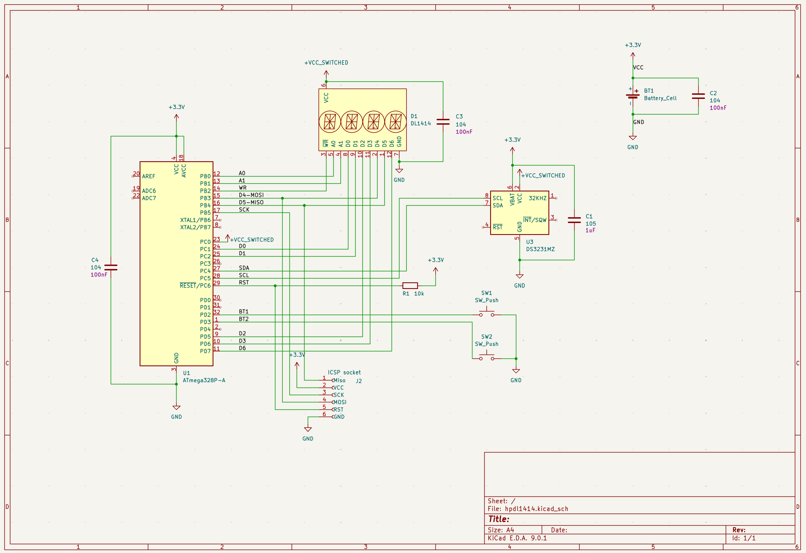
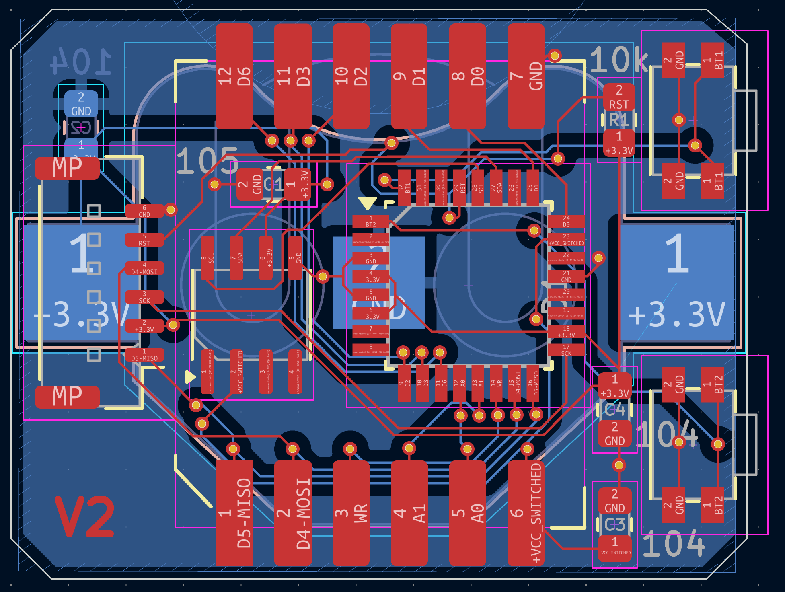
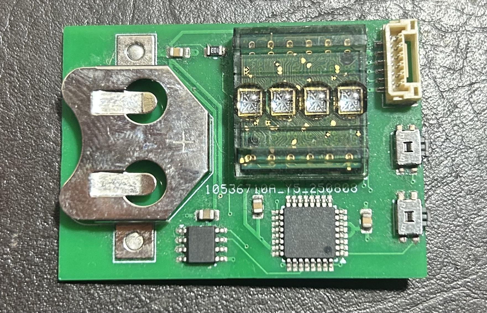
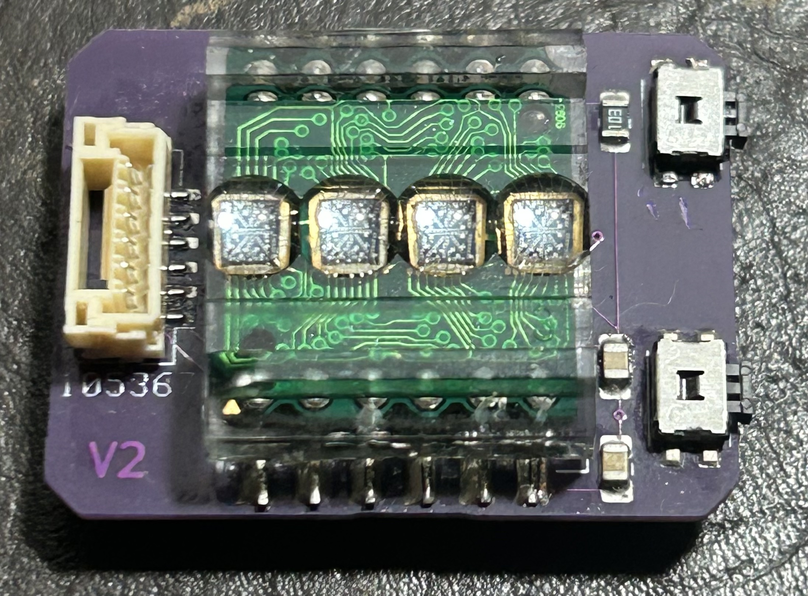
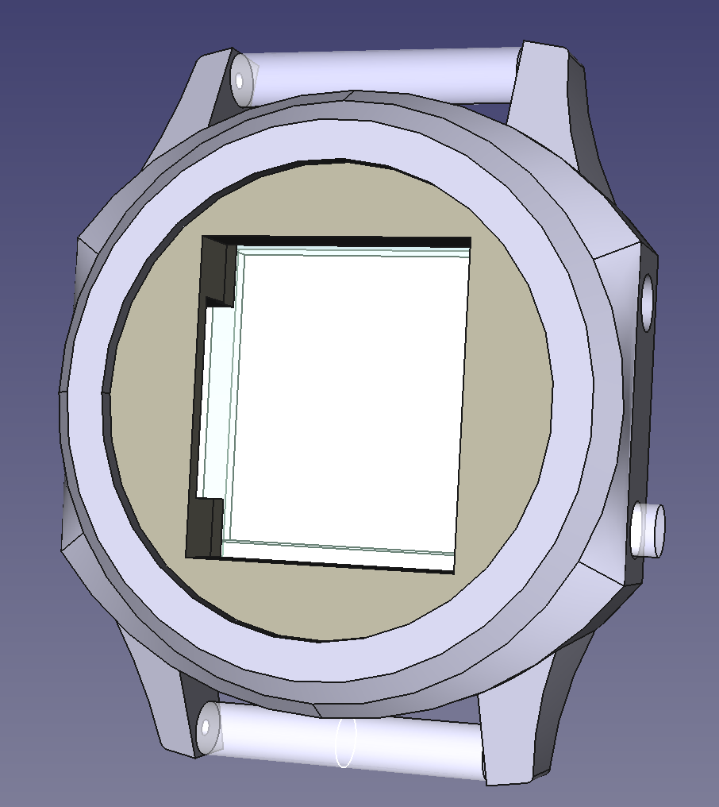
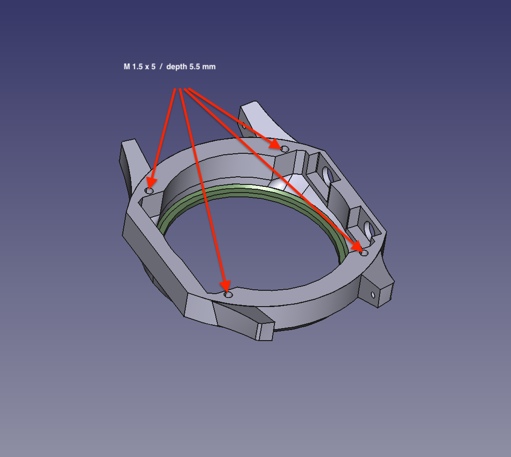

# HPDL-1414 Watch

A minimalist watch built around an [HPDL-1414](https://www.datasheetarchive.com/HPDL-1414-datasheet.html) 4-character alphanumeric display, driven by an ATmega32 microcontroller.

If you're brave enougth, you'll find anything you need to build it yourself in this repo.


There is a demo of the watch on youtube:

[](https://www.youtube.com/watch?v=RL6VkV0jNk0)

## Hardware

| Component | Details                                 |
| --------- | --------------------------------------- |
| MCU       | atmega328p                              |
| Display   | HPDL-1414 (4 × 16-segment alphanumeric) |
| RTC       | DS3231 (I2C)                            |
| Storage   | EEPROM (SPI)                            |
| Input     | 2 buttons                               |

You'll also need:

- A 3D printer for the case,
- A provider for the HPDL1414 displays. Aliexpress is a good source.
- I ordered the pcbs from jlcpcb. I chose to solder everything myself, but I think it'd be more reasonnable to order with all the components already soldered, except the display as they don't list it.

## Features

- Time display with configurable transitions
- Adjustable luminosity (stored in EEPROM)
- Low-power screen-off state
- State machine architecture

## Project Structure

```
hpdl-1414.ino          # Main sketch
src/
  screen-hpdl1414/     # HPDL-1414 driver
  rtc-ds3231/          # DS3231 RTC driver
  button/              # Button handler
  blinker/             # LED blinker
  persist-configuration/ # EEPROM persistence
  vcc-controller/      # Power control
  states/              # State machine
  pins.h               # Pin definitions
3dmodels/              # Model for the 3D printed case
```

## Watch PCB schematics

Open the schematics (`pcb/hpdl1414/hpdl1414.kicad_sch` and `pcb/hpdl1414/hpdl1414.kicad_pcb`) with [kicad 9.0.1](https://www.kicad.org/).




Here is the first prototype of the PCB I made. It offers a full view of all the components on one side:


And here is the final one that is in the watch. It is much smaller:


## Watch case

Open ‘3dmodels/HPDL1414-watch-round.FCStd‘ with [FreeCAD 1.0.2](https://www.freecad.org/). Export it part by part, and print it with your favorite 3d printer. I have great results with a [Bambu lab A1 mini](https://bambulab.com/en-eu/a1-mini).



You'll have to use threaded inserts, and M1.5 screws to bolt the back of the case:


## Watch software

I used a Mac for developping this project, but it should work with little to no adjustement on linux. Sorry Windows users, you're on your own on this one.

Also, I find the Arduino IDE really bad, but their libs are ok. So only their CLI is needed. Once installed, everything can be handled by the Makefile.

### Prerequisites

- [Arduino CLI](https://arduino.github.io/arduino-cli/latest/installation/)
- An Arduino board used as ISP programmer (e.g. Uno)

```bash
# Install Arduino CLI (macOS)
$ brew install arduino-cli
$ arduino-cli core install arduino:avr
```

For reference:

```bash
$ arduino-cli version
arduino-cli  Version: 1.4.1 Commit: Homebrew Date: 2026-01-19T16:11:40Z
$ ${HOME}/Library/Arduino15/packages/arduino/tools/avrdude/8.0.0-arduino1/bin/avrdude -v
Avrdude version 8.0-arduino.1
```

### Setup

Copy `config.mk.example` to `config.mk` and fill in your values:

```makefile
ARDUINO_ROOT="/path/to/Arduino15/packages/arduino"  # e.g. ~/Library/Arduino15/packages/arduino
ARDUINO_CLI="/path/to/arduino-cli"
FQBN=arduino:avr:uno      # FQBN of the ISP programmer board
PORT=/dev/cu.usbmodem...  # port of the ISP programmer (make list-devices)
```

### Build & Flash

```bash
# First time: flash the ISP programmer
make flash-isp-programmer

# Set fuses on the target ATmega32
make set-target-clock-fuses

# Compile and upload the firmware
make upload
```

Run `make help` for all available targets.

## License

MIT
